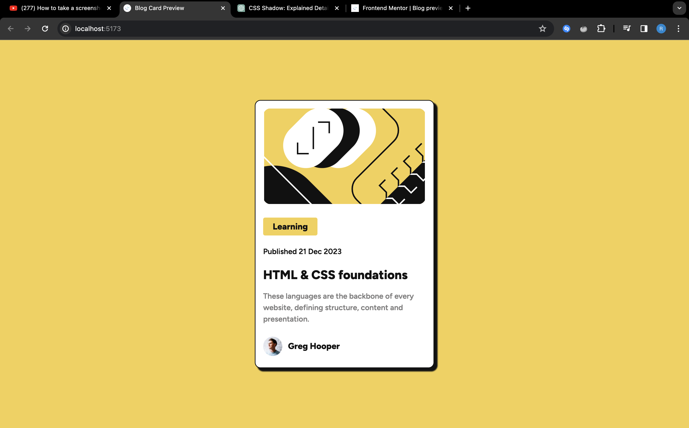

# Frontend Mentor - Blog preview card solution

This is a solution to the [Blog preview card challenge on Frontend Mentor](https://www.frontendmentor.io/challenges/blog-preview-card-ckPaj01IcS). It involves creating a responsive blog card preview using HTML and CSS, with a focus on hover and focus states for interactive elements.

## Table of contents

- [Overview](#overview)
  - [The challenge](#the-challenge)
  - [Screenshot](#screenshot)
  - [Links](#links)
- [My process](#my-process)
  - [Built with](#built-with)
  - [What I learned](#what-i-learned)
  - [Continued development](#continued-development)
  - [Useful resources](#useful-resources)
- [Author](#author)
- [Acknowledgments](#acknowledgments)


## Overview

### The challenge

The challenge involves creating a blog card preview with hover and focus states for interactive elements.

### Screenshot




### Links

- Solution URL: [Add solution URL here](https://github.com/richard9809/blog-preview-card)
- Live Site URL: [Add live site URL here](https://venerable-kashata-87edfb.netlify.app)

## My process

### Built with

- Semantic HTML5 markup
- CSS custom properties
- Flexbox
- Mobile-first workflow


### What I learned

During this project, I learned to implement hover and focus states effectively. 

```css
.title:hover,
.title:focus {
  color: hsl(47, 88%, 50%);
}
```

I also learnt how to import google fonts using css.

```css
@import url("https://fonts.googleapis.com/css2?family=Figtree:wght@600;800&display=swap");

body {
  font-family: "Figtree", sans-serif;
}
```

### Continued development

I plan to continue refining my skills in creating responsive designs and enhancing user interactions with more advanced CSS features.


### Useful resources

- [MDN Web Docs](https://developer.mozilla.org/en-US/) - An excellent resource for HTML, CSS, and JavaScript documentation.

- [Frontend Mentor](https://www.example.com) - This is an amazing article which helped me finally understand XYZ. I'd recommend it to anyone still learning this concept.

**Note: Delete this note and replace the list above with resources that helped you during the challenge. These could come in handy for anyone viewing your solution or for yourself when you look back on this project in the future.**

## Author

- Frontend Mentor - [@richard9809](https://www.frontendmentor.io/profile/richard9809)
- Twitter - [@rmulu333](https://www.twitter.com/rmulu333)

## Acknowledgments

I'd like to acknowledge the helpful resources and support from the Frontend Mentor community. This project allowed me to practice and improve my web development skills.

